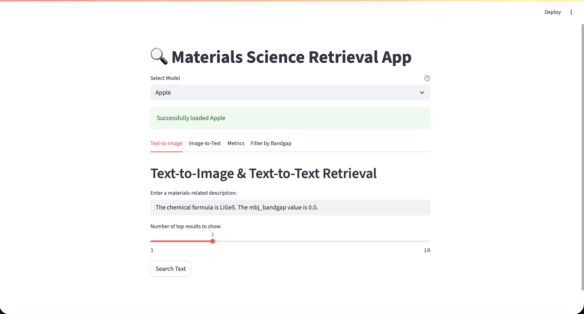

# MaterialVision: Interactive Materials Science Retrieval System

[](https://www.python.org/downloads/)
[](https://pytorch.org/)
[](https://streamlit.io/)
[](https://opensource.org/licenses/MIT)

MaterialVision is an advanced multimodal retrieval system that bridges materials science textual descriptions with STEM (Scanning Transmission Electron Microscopy) imaging data. It features an interactive web application for text-to-image and image-to-text retrieval using state-of-the-art vision-language models.

## 📱 Web Application Preview



*Interactive web interface featuring text-to-image search, image upload, model comparison, and real-time similarity analysis.*

---

## 🚀 Quick Start

### 🖥️ Web Application
```bash
# Clone and setup
git clone https://github.com/your-username/MaterialVision.git
cd MaterialVision
pip install -r requirements.txt

# Launch web app
cd webapp && streamlit run app.py
```

### 🐍 Python API
```python
from models import load_clipp_scibert

# Load model
model, tokenizer, dataset = load_clipp_scibert('models/CLIPP_allenai/checkpoints/best_clipp.pth', 'cuda')

# Generate embeddings
text = "The chemical formula is LiGeS. The mbj_bandgap value is 0.0."
tokens = tokenizer(text, return_tensors="pt", max_length=512)
embeddings = model.get_text_features(tokens['input_ids'], tokens['attention_mask'])
```

---

## 🎯 Key Features

| Feature | Description |
|---------|-------------|
| 🔍 **Text-to-Image Search** | Find STEM images using materials descriptions |
| 🖼️ **Image-to-Text Retrieval** | Upload images to find matching descriptions |
| ⚖️ **Multi-Model Comparison** | Compare results across 4 different models |
| 📊 **Real-time Analytics** | Performance metrics and similarity heatmaps |
| 🔬 **Bandgap Filtering** | Filter materials by electronic properties |
| 📈 **t-SNE Visualization** | Explore embedding space alignment |

---

## 🏗️ Model Architectures

| Model | Text Encoder | Vision Encoder | Best For |
|-------|--------------|----------------|----------|
| **CLIPP-SciBERT** | SciBERT | ViT-Base/16 | Scientific text understanding |
| **CLIPP-DistilBERT** | DistilBERT | ViT-Base/16 | Fast inference |
| **Apple MobileCLIP** | MobileBERT | MobileViT | Mobile/edge deployment |
| **BLIP (Salesforce)** | BERT | ViT-Large/16 | Best overall performance |

---

## 📊 Performance Results

### 🎯 Validation Set (Text↔Image Retrieval)

| Model | Text→Image Top-10 | Image→Text Top-10 | Average |
|-------|------------------|------------------|---------|
| **BLIP (Salesforce)** | **80.9%** | **80.1%** | **80.5%** 🥇 |
| **Apple MobileCLIP** | 76.7% | 77.6% | 77.2% |
| **CLIPP-SciBERT** | 74.9% | 74.9% | 74.9% |
| **CLIPP-DistilBERT** | 49.8% | 50.6% | 50.2% |

### 🏋️ Training Set (Text↔Image Retrieval)

| Model | Text→Image Top-10 | Image→Text Top-10 | Average |
|-------|------------------|------------------|---------|
| **Apple MobileCLIP** | **97.8%** | **97.4%** | **97.6%** 🥇 |
| **BLIP (Salesforce)** | 96.9% | 96.4% | 96.7% |
| **CLIPP-SciBERT** | 90.3% | 90.9% | 90.6% |
| **CLIPP-DistilBERT** | 52.6% | 54.5% | 53.6% |

<details>
<summary>📈 Detailed Performance Breakdown</summary>

#### Validation Set Results
```
CLIPP-SciBERT:
├── Text→Image: Top-1: 36.9%  Top-5: 65.1%  Top-10: 74.9%
└── Image→Text: Top-1: 36.6%  Top-5: 66.2%  Top-10: 74.9%

CLIPP-DistilBERT: 
├── Text→Image: Top-1: 12.5%  Top-5: 36.6%  Top-10: 49.8%
└── Image→Text: Top-1: 14.2%  Top-5: 37.4%  Top-10: 50.6%

Apple MobileCLIP:
├── Text→Image: Top-1: 38.0%  Top-5: 67.0%  Top-10: 76.7%
└── Image→Text: Top-1: 35.9%  Top-5: 65.4%  Top-10: 77.6%

BLIP (Salesforce):
├── Text→Image: Top-1: 46.8%  Top-5: 72.9%  Top-10: 80.9%
└── Image→Text: Top-1: 45.3%  Top-5: 73.6%  Top-10: 80.1%
```

#### Training Set Results  
```
CLIPP-SciBERT:
├── Text→Image: Top-1: 44.9%  Top-5: 80.5%  Top-10: 90.3%
└── Image→Text: Top-1: 47.2%  Top-5: 81.9%  Top-10: 90.9%

CLIPP-DistilBERT:
├── Text→Image: Top-1: 14.6%  Top-5: 39.3%  Top-10: 52.6%
└── Image→Text: Top-1: 14.3%  Top-5: 40.3%  Top-10: 54.5%

Apple MobileCLIP:
├── Text→Image: Top-1: 63.0%  Top-5: 93.8%  Top-10: 97.8%
└── Image→Text: Top-1: 60.5%  Top-5: 92.4%  Top-10: 97.4%

BLIP (Salesforce):
├── Text→Image: Top-1: 57.1%  Top-5: 90.5%  Top-10: 96.9%
└── Image→Text: Top-1: 56.6%  Top-5: 90.4%  Top-10: 96.4%
```
</details>

---

## 🛠️ Installation

### Option 1: Using pip (Recommended)
```bash
# Clone repository
git clone https://github.com/your-username/MaterialVision.git
cd MaterialVision

# Install dependencies
pip install -r requirements.txt

# Launch web app
cd webapp && streamlit run app.py
```

### Option 2: Using conda
```bash
# Clone repository
git clone https://github.com/your-username/MaterialVision.git
cd MaterialVision

# Create conda environment
conda env create -f environment.yml
conda activate clipp

# Launch web app
cd webapp && streamlit run app.py
```

### 🔧 Manual Installation
```bash
# Core dependencies
pip install torch torchvision transformers>=4.30.0
pip install streamlit pandas numpy pillow
pip install open-clip-torch timm scikit-learn
pip install matplotlib seaborn tqdm
```

### 📋 System Requirements
- **Python**: 3.9+
- **GPU**: CUDA-compatible GPU recommended
- **RAM**: 8GB+ (16GB recommended)
- **Storage**: 5GB+ for models and data

---

## 💻 Usage Examples

### 🖥️ Web Interface

1. **Text-to-Image Search**
   - Enter materials description: `"Silicon carbide semiconductor with 2.3 eV bandgap"`
   - View top matching STEM images with similarity scores
   - Compare results across different models

2. **Image-to-Text Retrieval**
   - Drag & drop STEM images
   - Get matching material descriptions
   - Explore chemical formulas and properties

3. **Bandgap Filtering**
   - Use sliders to set bandgap range (0.0-10.0 eV)
   - Filter materials by electronic properties
   - Export filtered datasets as CSV

### 🐍 Python API

#### Basic Embedding Generation
```python
from models import load_clipp_scibert
import torch

# Load model
device = 'cuda' if torch.cuda.is_available() else 'cpu'
model, tokenizer, dataset = load_clipp_scibert(
    'models/CLIPP_allenai/checkpoints/best_clipp.pth', device
)

# Generate text embeddings
texts = ["Silicon carbide semiconductor", "Iron oxide magnetic material"]
embeddings = []

model.eval()
with torch.no_grad():
    for text in texts:
        tokens = tokenizer(text, padding=True, truncation=True, 
                         return_tensors="pt", max_length=512).to(device)
        text_features = model.get_text_features(
            tokens['input_ids'], tokens['attention_mask']
        )
        embeddings.append(text_features.cpu().numpy())
```

#### Chemical Formula Processing
```python
import re

def parse_chemical_formula(formula):
    """Convert Fe2O3 -> 2 Fe 3 O format"""
    pattern = r'([A-Z][a-z]?)(\d*)'
    matches = re.findall(pattern, formula)
    
    result_parts = []
    for element, count in matches:
        count = "1" if not count else count
        result_parts.extend([count, element])
    
    return ' '.join(result_parts)

# Example
parsed = parse_chemical_formula("Fe2O3")  # "2 Fe 3 O"
```

#### Similarity Search with Filtering
```python
import torch.nn.functional as F

def search_by_bandgap(query_text, min_bg, max_bg, top_k=5):
    # Generate query embedding
    tokens = tokenizer(query_text, return_tensors="pt", max_length=512)
    query_embed = model.get_text_features(tokens['input_ids'], tokens['attention_mask'])
    
    # Filter by bandgap range
    filtered_indices = [
        i for i, bg in enumerate(bandgaps) 
        if bg and min_bg <= bg <= max_bg
    ]
    
    # Compute similarities
    filtered_embeds = corpus_embeddings[filtered_indices]
    similarities = F.cosine_similarity(query_embed, filtered_embeds)
    
    # Get top-k results
    topk = torch.topk(similarities, min(top_k, len(similarities)))
    return filtered_indices[topk.indices], topk.values
```

---

## 📁 Project Structure

```
MaterialVision/
├── 📄 README.md
├── 📄 requirements.txt          # Python dependencies
├── 📄 environment.yml           # Conda environment
├── 📄 LICENSE
├── 🗂️ webapp/
│   ├── 🐍 app.py               # Streamlit web application
│   ├── 🐍 models.py            # Model loading utilities  
│   ├── 📓 simple_text_embedding.ipynb
│   ├── 📓 test_model_loading.ipynb
│   └── 📁 embeddings/          # Cached embeddings
├── 🗂️ models/
│   ├── 📁 CLIPP_allenai/       # SciBERT-based model
│   ├── 📁 CLIPP_bert/          # DistilBERT-based model
│   ├── 📁 Apple_MobileCLIP/    # Apple MobileCLIP
│   └── 📁 Salesforce/          # BLIP model
├── 🗂️ data/
│   ├── 📊 alpaca_mbj_bandgap_train.csv
│   ├── 📊 alpaca_mbj_bandgap_test.csv
│   ├── 📁 train/               # Training images
│   └── 📁 test/                # Validation images
└── 🗂️ tests/                   # Development notebooks
```

---

## 📈 Advanced Features

### 🔬 Embedding Visualization
Each model includes t-SNE visualization for analyzing multimodal alignment:

- **Dimensionality Reduction**: Projects high-dimensional embeddings to 2D
- **Alignment Quality**: Shows how well text-image pairs cluster together
- **Model Comparison**: Visual assessment across architectures
- **Pair Highlighting**: Connected lines show corresponding embeddings

Generated visualizations:
- `clipp_scibert_tsne.png`
- `clipp_distilbert_tsne.png`  
- `mobileclip_apple_tsne.png`
- `salesforce_blip_tsne.png`

### 📊 Performance Monitoring
Real-time metrics in the web application:
- **Similarity Heatmaps**: Understand model behavior
- **Top-k Accuracy**: Monitor retrieval performance
- **Comparison Charts**: Side-by-side model analysis

### 🔧 Model Architecture Details

<details>
<summary>🏗️ CLIPP Architecture</summary>

```python
class CLIPPModel:
    def __init__(self):
        self.vision_encoder = ViT_Base_16()      # 224x224 patches
        self.text_encoder = SciBERT()            # Scientific vocabulary
        self.projection_dim = 256                # Joint embedding space
        self.temperature = 0.07                  # Contrastive learning
    
    def forward(self, images, texts):
        img_features = self.vision_encoder(images)
        txt_features = self.text_encoder(texts)
        
        # Project to shared space
        img_embeds = self.img_projection(img_features)
        txt_embeds = self.txt_projection(txt_features)
        
        return F.normalize(img_embeds), F.normalize(txt_embeds)
```
</details>

<details>
<summary>🏗️ BLIP Architecture</summary>

```python
class BLIPModel:
    def __init__(self):
        self.vision_encoder = ViT_Large_16()     # Larger vision model
        self.text_encoder = BERT()               # Standard BERT
        self.cross_attention = MultiheadAttention() # Cross-modal fusion
        
    def forward(self, images, texts):
        # Dual-encoder + cross-attention
        vision_embeds = self.vision_encoder(images)
        text_embeds = self.text_encoder(texts)
        
        # Cross-modal attention for better alignment
        fused_embeds = self.cross_attention(vision_embeds, text_embeds)
        return fused_embeds
```
</details>

---

## 🔬 Applications

### Materials Discovery
- **Interactive Search**: Find materials by description or image
- **Property Filtering**: Search by bandgap, composition, structure
- **Model Comparison**: Evaluate different retrieval approaches
- **Dataset Export**: Download filtered results for analysis

### Research Use Cases
- **Literature Review**: Find visual examples of described materials
- **Image Classification**: Identify unknown materials from STEM images
- **Property Prediction**: Infer properties from visual similarity
- **Dataset Augmentation**: Generate paired text-image data

### Educational Applications
- **Materials Science Teaching**: Visual learning with real examples
- **Student Projects**: Hands-on experience with ML models
- **Research Training**: Understanding multimodal AI systems

---

## 🛠️ Development

### Adding New Models
```python
# Extend models.py
def load_custom_model(checkpoint_path, device):
    model = YourCustomModel()
    checkpoint = torch.load(checkpoint_path, map_location=device)
    model.load_state_dict(checkpoint['model_state_dict'])
    return model, tokenizer, dataset

# Add to app.py
MODEL_PATHS['YourModel'] = 'path/to/checkpoint.pth'
```

### Custom Datasets
```python
# Process new datasets
def process_new_dataset(data_path, model_name):
    df = pd.read_csv(data_path)
    model, tokenizer, _ = load_model(model_name)
    
    embeddings = []
    for text in df['descriptions']:
        embedding = generate_embedding(model, tokenizer, text)
        embeddings.append(embedding)
    
    df['embeddings'] = embeddings
    return df
```

### Testing
```bash
# Run tests
python -m pytest tests/
streamlit run webapp/app.py  # Manual UI testing
```

---

## 🤝 Contributing

We welcome contributions! Areas for improvement:

- 🔬 **New model architectures** for better materials understanding
- 📊 **Dataset expansion** with additional properties
- ⚡ **Performance optimizations** for faster inference  
- 🎨 **UI/UX improvements** for better user experience
- 📚 **Documentation and tutorials**

### Development Workflow
```bash
# Fork and clone
git clone https://github.com/your-username/MaterialVision.git
cd MaterialVision

# Create feature branch
git checkout -b feature/your-improvement

# Make changes and test
pytest tests/
streamlit run webapp/app.py

# Submit pull request
git push origin feature/your-improvement
```

---

## 📚 Resources & Documentation

### 📓 Jupyter Notebooks
- [`simple_text_embedding.ipynb`](webapp/simple_text_embedding.ipynb) - Embedding generation
- [`howtoreadData.ipynb`](tests/howtoreadData.ipynb) - Data loading examples
- [`image_test.ipynb`](tests/image_test.ipynb) - STEM image processing
- Model evaluation notebooks in each `models/*/` directory

### 🔗 External Resources
- [Hugging Face Transformers](https://huggingface.co/docs/transformers/) - Model implementations
- [Streamlit Documentation](https://docs.streamlit.io/) - Web app framework
- [OpenAI CLIP](https://openai.com/research/clip) - Foundational architecture
- [Materials Project](https://materialsproject.org/) - Materials database

### 📊 Datasets
- **Training**: 1,000+ STEM images with materials descriptions
- **Validation**: 500+ test samples for evaluation
- **Properties**: Chemical formulas, bandgaps, structures

---

## 📄 License

This project is licensed under the MIT License - see the [LICENSE](LICENSE) file for details.

## 📞 Support

- 🐛 **Issues**: [GitHub Issues](https://github.com/mntalha/MaterialVision/issues)
- 💬 **Discussions**: [GitHub Discussions](https://github.com/mntalha/MaterialVision/discussions)
- 📧 **Contact**: Open an issue for questions

## 🙏 Acknowledgments

- **Hugging Face** for transformer implementations
- **Streamlit** for the web framework  
- **OpenAI** for the CLIP architecture
- **Materials Science Community** for domain expertise

---

<div align="center">

**🔬 Happy Materials Discovery! 🧪**


</div>