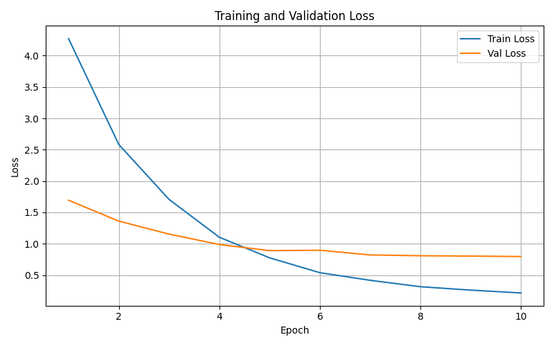

# MaterialVision: Matching Materials Science Prompts with STEM Images

MaterialVision is an innovative project that bridges the gap between textual descriptions of materials and their visual representations through STEM (Scanning Transmission Electron Microscopy) imaging. The project employs Vision Transformers to establish connections between materials science prompts and their corresponding atomic-scale images.

## Project Overview

This project combines three key elements:
1. Materials Science knowledge representation
2. STEM image simulation and analysis
3. Vision Transformer-based matching algorithms

### Key Features

#### 1. STEM Image Processing
- Generation of STEM simulations from atomic structures
- Image processing and enhancement
- Feature extraction from atomic-scale images

#### 2. Text-Image Matching
- Processing of materials science prompts
- Correlation between textual descriptions and image features
- Semantic understanding of materials properties

#### 3. Vision Transformer Implementation
- Advanced image analysis capabilities
- Multi-modal learning (text and image)
- Structure-property relationship understanding

## Repository Structure

```
MaterialVision/
├── codes/
│   ├── helper.py         # Utility functions for data processing
│   └── ...              # Additional implementation files
├── tests/
│   ├── howtoreadData.ipynb   # Data reading and analysis examples
│   ├── image_test.ipynb      # STEM simulation demonstrations
│   └── ...
└── data/                # Dataset storage
```

## Getting Started

### Prerequisites
```bash
# Clone the repository
git clone [repository-url]

# # Install dependencies
# pip install -r requirements.txt
# ```

### Usage Examples

1. **Reading and Processing Data**
```python
from codes.helper import load_and_preprocess_data

# Load your dataset
data = load_and_preprocess_data('path_to_your_data.csv')
```

2. **STEM Image Generation**
```python
from jarvis.analysis.stem.convolution_apprx import STEMConv
from jarvis.core.atoms import Atoms

# Generate STEM image from atomic structure
stem_sim = STEMConv(output_size=[200, 200])
stem_image = stem_sim.simulate_surface(atoms=structure)[0]
```

## Features in Detail

### 1. Data Processing
- Comprehensive data loading and preprocessing
- Statistical analysis tools
- Visualization capabilities

### 2. STEM Simulation
- Atomic structure visualization
- STEM image generation
- Image processing and enhancement

#### 3. Vision Transformer Integration
- Text-image matching
- Feature extraction
- Multi-modal learning

## Model Performance Comparison

We compare two approaches for materials science text-image retrieval:
1. **CLIPP**: Our custom dual-encoder model trained from scratch
2. **BLIP**: Fine-tuned Salesforce BLIP model (blip-itm-large-coco)

### Training Progress

#### CLIPP Training and Validation Loss

*Training progress of our custom CLIPP model*

#### BLIP Training and Validation Loss

*Training progress of the fine-tuned BLIP model*

### Retrieval Performance

Below are the image-text retrieval metrics (Top-k accuracy) for both models:

#### CLIPP Models Performance

##### CLIPP-SciBERT
```
Validation Set:
- Top-1: 0.1670
- Top-5: 0.4040
- Top-10: 0.5300

Training Set:
- Top-1: 0.1930
- Top-5: 0.4856
- Top-10: 0.6360
```

##### CLIPP-DistilBERT
```
Validation Set:
- Top-1: 0.0400
- Top-5: 0.1430
- Top-10: 0.2120

Training Set:
- Top-1: 0.0202
- Top-5: 0.0764
- Top-10: 0.1330
```

#### BLIP Model Performance
```
Validation Set:
- Top-1: 0.1730
- Top-5: 0.4290
- Top-10: 0.5520

Training Set:
- Top-1: 0.3868
- Top-5: 0.7564
- Top-10: 0.8728
```

### Model Characteristics

**CLIPP Models**

*CLIPP-SciBERT*
- Vision encoder: Pretrained ViT-Base/16 (patch size 16x224x224)
- Text encoder: SciBERT (allenai/scibert_scivocab_uncased)
- Training: CLIP-style contrastive learning with temperature 0.07
- Projection: Both image and text features projected to 256-dim space
- Loss: Bidirectional contrastive loss (image→text and text→image)

*CLIPP-DistilBERT*
- Vision encoder: Pretrained ViT-Base/16 (patch size 16x224x224)
- Text encoder: DistilBERT (distilbert-base-uncased)
- Training: CLIP-style contrastive learning with temperature 0.07
- Projection: Both image and text features projected to 256-dim space
- Loss: Bidirectional contrastive loss (image→text and text→image)
- Advantage: Lighter text encoder with comparable performance

**BLIP**
- Base model: "Salesforce/blip-itm-large-coco"
- Architecture: ViT-L/16 vision encoder + BERT text encoder
- Training: Fine-tuned with image-text matching (ITM)
- Original pretraining: COCO dataset with 850K images
- Adapts general visual understanding to materials domain

## Applications

- **Materials Discovery**: Rapid screening and analysis of materials
- **Structure Analysis**: Understanding atomic-scale arrangements
- **Property Prediction**: Correlating structure with properties
- **Image-Text Matching**: Connecting descriptions with visual data

## Contributing

Contributions are welcome! Please feel free to submit a Pull Request.

## License

This project is licensed under the MIT License - see the LICENSE file for details.

## Contact

For questions and feedback, please open an issue in the repository.
